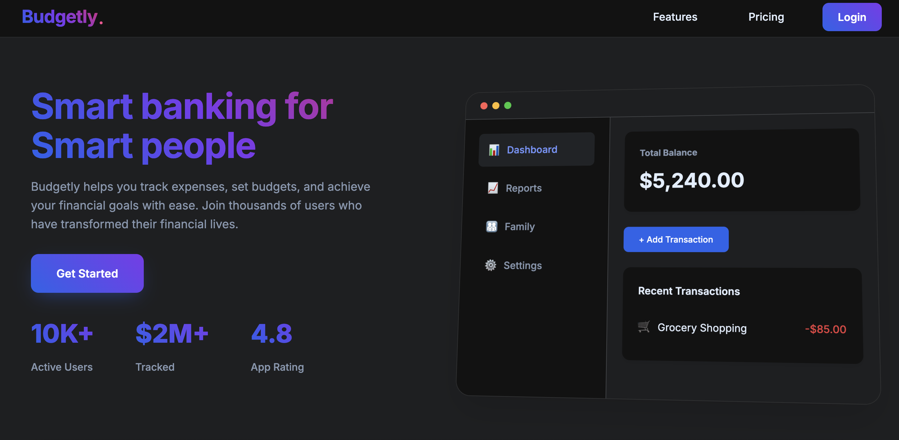
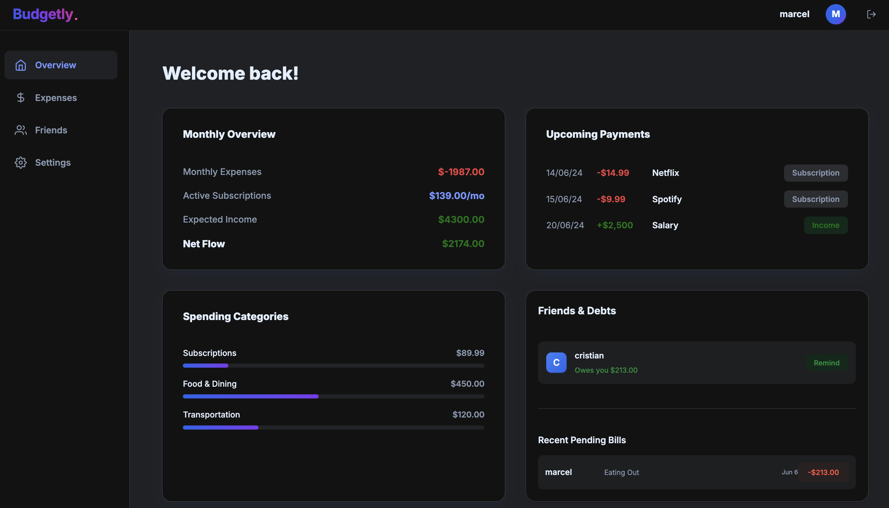
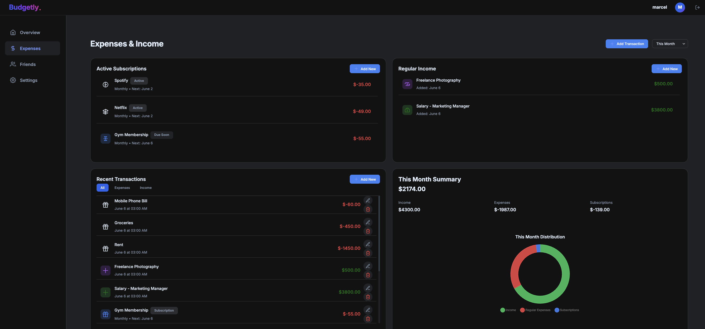
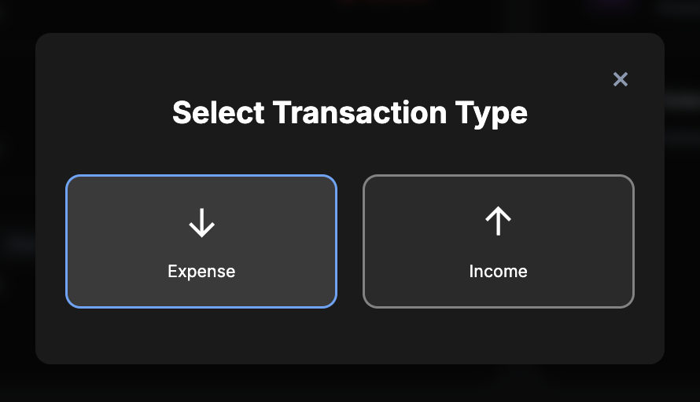
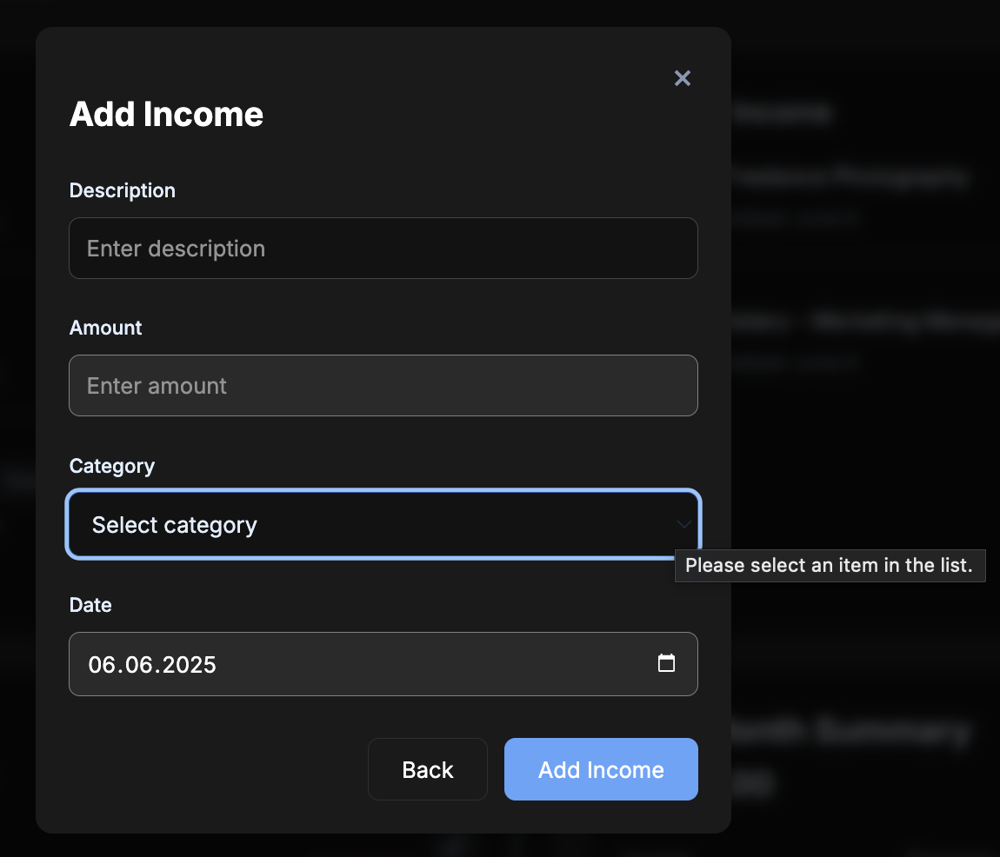
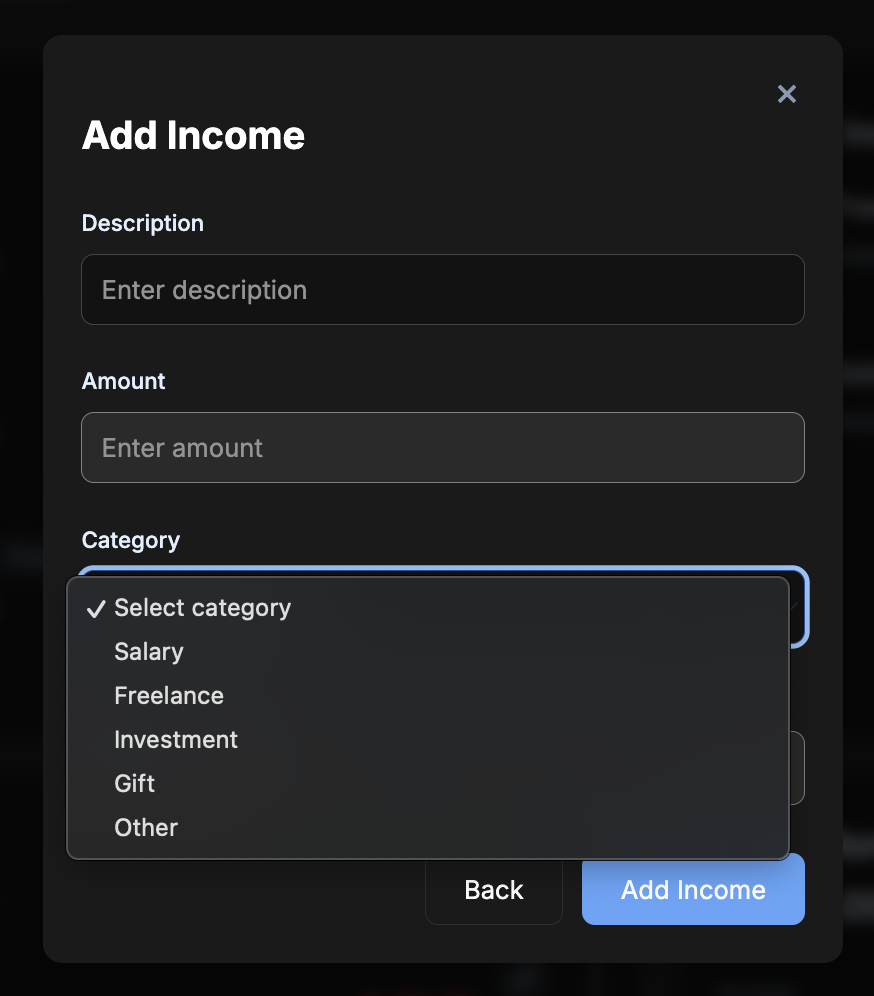
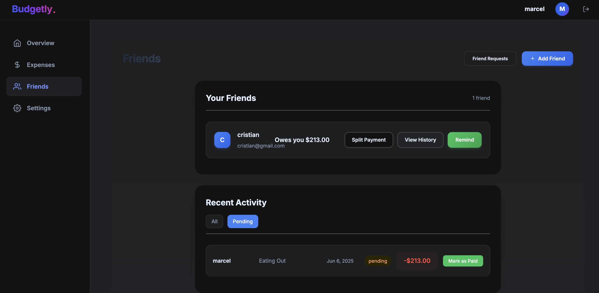
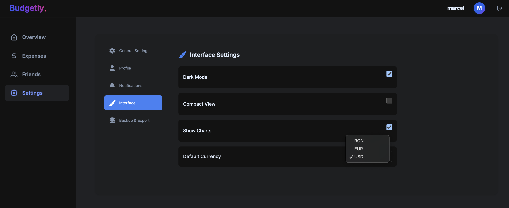

# BudgetLy


**BudgetLy** is a collaborative finance management web application that helps users track expenses, set budgets, and analyze financial habits. Developed as a team project, the app offers a modern and intuitive user interface backed by a full-stack implementation.

---

## Features

- Dashboard overview with financial summaries  
- Add and manage income and expenses  
- Categorized transaction tracking  
- Monthly financial summary and chart visualization  
- Friends module for shared expenses and reminders  
- Interface customization (theme, currency, chart visibility)  

---

## Tech Stack

- **Frontend**: React.js  
- **Backend**: Node.js with Express  
- **Database**: MongoDB 
 
---

## Preview

### Landing Page

Initial landing section, displaying promotional content and app statistics.



---

### Personalized Dashboard

Financial overview with key metrics like net flow, upcoming payments, and category-based spendings.



---

### Income & Expense Summary

Central section where users can manage income, expenses, and visualize their monthly balance.



---

### Adding Transactions

Below is the process for logging new transactions, showing the modal for type selection, income form, and category dropdown:

<table align="center">
  <tr>
    <td></td>
    <td></td>
    <td></td>
  </tr>
</table>


---

### Friends & Payments

View and manage debts between friends, including reminder options and payment history.



---

### Interface Settings

Users can customize the app by switching themes, currencies, or enabling/disabling charts.



---

## Setup

1. Clone the repository:  
   ```bash
   git clone https://github.com/carlabarastean/BudgetLy_app.git
   ```
2. Navigate to the actual project directory:
   ```bash
   cd II_PROIECT/iiProject
   ```
   
3. Install dependencies:  
   ```bash
   cd client
   npm install

   cd ../server
   npm install
   ```

4. Start development:  
   Backend:  
   ```bash
   npm start dev
   ```  
   Frontend:  
   ```bash
   cd ../client
   npm start
   ```

---

## Future Improvements

We’d love to take **BudgetLy** even further with:

- **Export options** — Let users download their transaction history as CSV or PDF for offline use or reporting.
- **Smart reminders** — Add customizable notifications for budget limits or upcoming due dates.
- **AI-powered insights**:  
  - **Spending predictions & saving suggestions** – Help users better plan by estimating future expenses and potential savings.  
  - **Automatic transaction categorization** – Use an AI model trained on transaction descriptions to sort spending into relevant categories (groceries, utilities, entertainment, etc.).  
  - **Anomaly detection & subscription tracking** – Flag unusual transactions or forgotten subscriptions (like a streaming service unused for months), and suggest possible actions.


   ---
## Contact

For more details or collaboration:
- Email: carlabarastean@gmail.com
- LinkedIn: [linkedin.com/in/carla-barastean-621326269](https://www.linkedin.com/in/carla-barastean-621326269)

Thank you for visiting this project!
